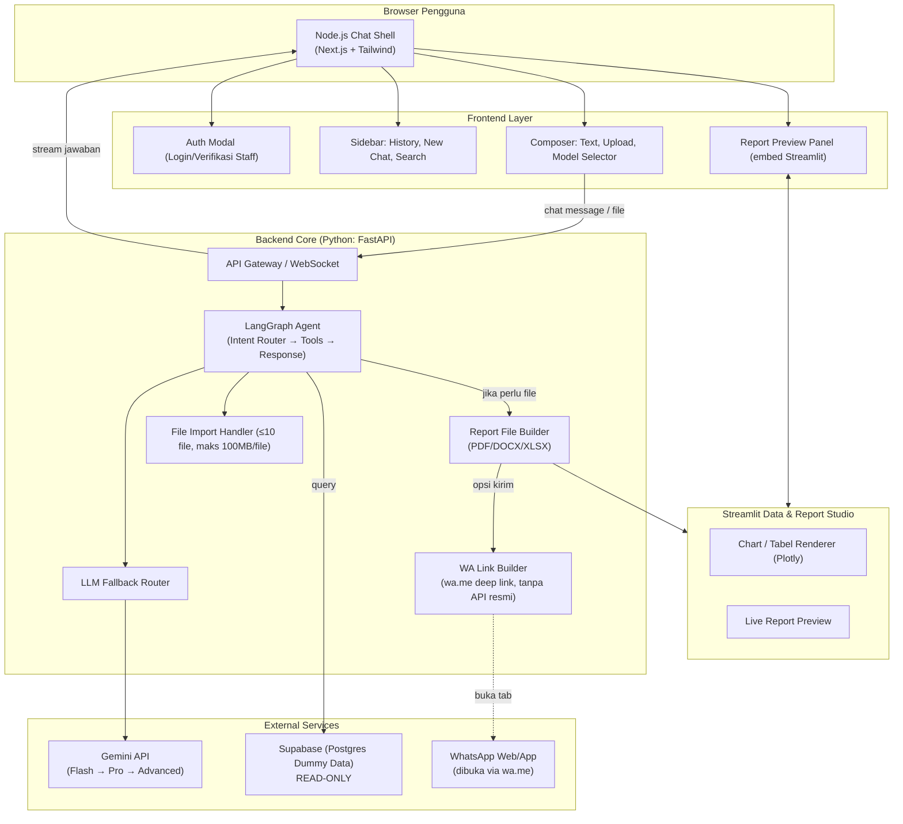
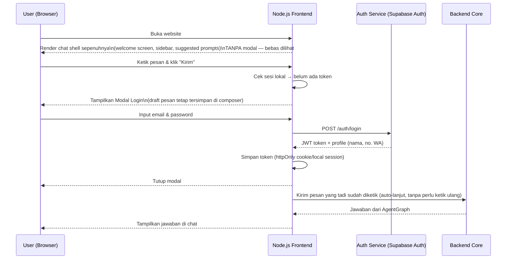
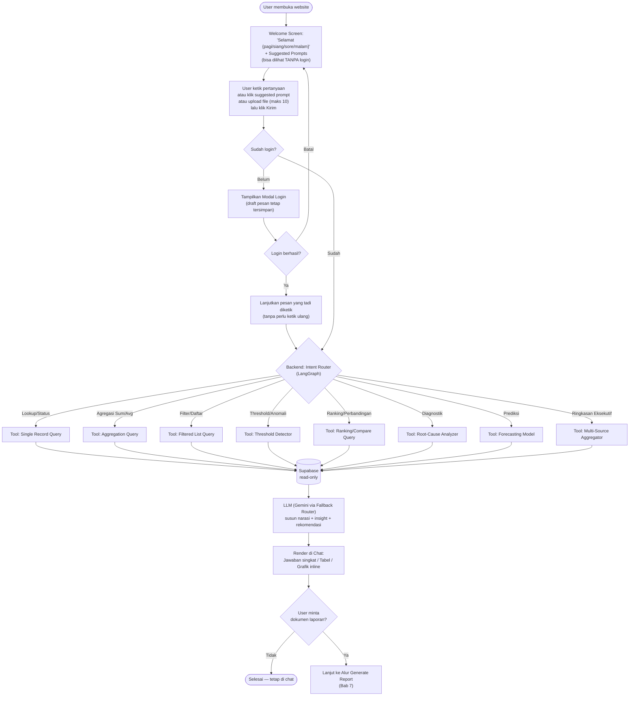
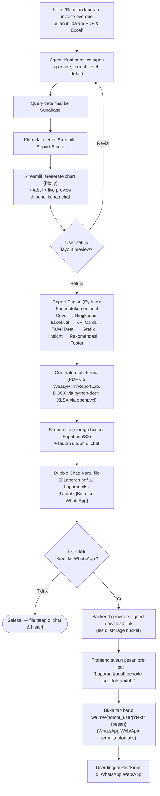
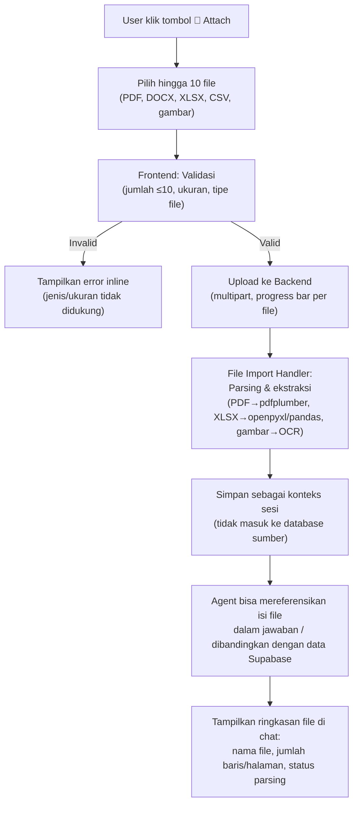
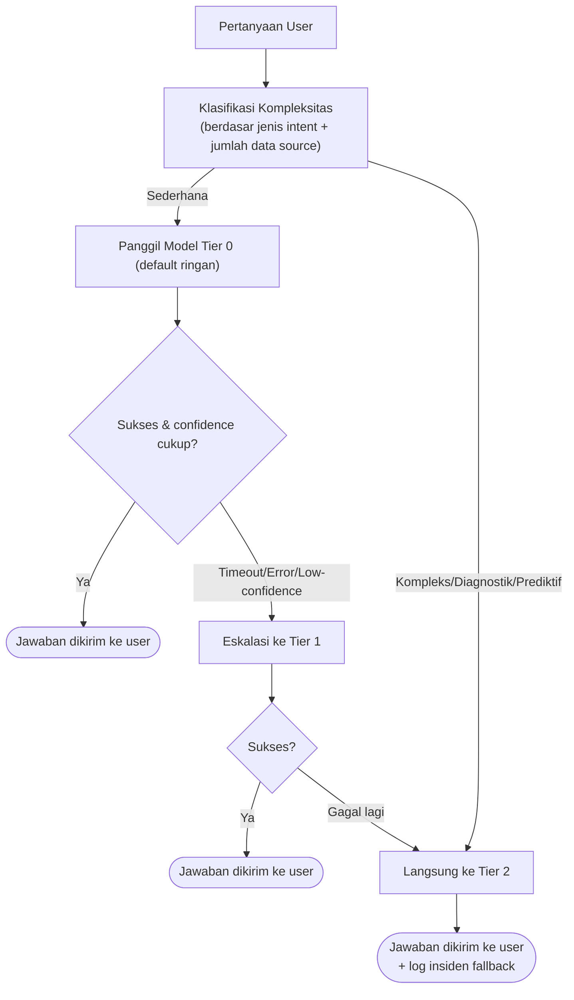
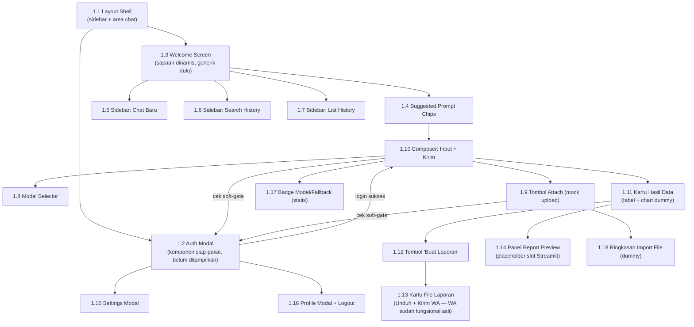

# PRD — TelkomInfra AI Financial Assistant (TIFA)
**Product Requirements Document & Workflow Blueprint**

| | |
|---|---|
| **Nama Produk (usulan)** | TIFA — TelkomInfra Financial Assistant |
| **Versi Dokumen** | 1.0 |
| **Tanggal** | 8 Juli 2026 |
| **Pemilik Produk** | Viki Firmansyah |
| **Status** | Draft untuk kick-off development |

---

## 0. Ringkasan Satu Layar

TIFA adalah chatbot AI internal Telkominfra yang berfungsi seperti Gemini/ChatGPT/Claude dari sisi UX, tetapi **berspesialisasi pada domain PO to Cash In** (Purchase Order, Sales Order, Contract, Invoice, Cash In, Project, dan ringkasan Executive). Pengguna (staff Telkominfra yang sudah login/terverifikasi) bisa bertanya dalam bahasa natural, dan sistem akan:

1. Mengambil data (saat ini dummy) dari **Supabase** secara **read-only**.
2. Memprosesnya lewat **LangGraph/LangChain agent** yang dipandu oleh **Gemini API** dengan **skema fallback model**.
3. Menyajikan jawaban di chat (angka, tabel, insight, grafik).
4. Bila diminta, **men-generate dokumen laporan keuangan profesional** (PDF/Word/Excel, bisa multi-file hingga 10 sekaligus).
5. Menawarkan opsi **kirim laporan ke WhatsApp** pengguna.

Frontend chat-shell dibangun dengan **Node.js**, sedangkan **Streamlit** dipakai khusus sebagai *rendering/authoring engine* untuk grafik, tabel data, dan preview laporan (dua sistem saling melengkapi, bukan duplikasi — detail di Bab 4).

---

## 1. Latar Belakang & Tujuan

### 1.1 Masalah yang Diselesaikan
- Staff finance/PO-to-Cash Telkominfra perlu waktu lama menyusun laporan (menarik data manual, format ulang, buat chart, susun narasi).
- Insight (root cause, prediksi cash in, risiko customer telat bayar) butuh analisa manual berulang.
- Distribusi laporan (kirim ke stakeholder) masih manual via email/WA copy-paste.

### 1.2 Tujuan Produk
1. Menyediakan antarmuka chat yang familiar (seperti Gemini/ChatGPT) untuk query data keuangan.
2. Otomatisasi pembuatan laporan profesional (tabel + chart + insight + rekomendasi) dalam format PDF/Word/Excel.
3. Mempercepat distribusi laporan lewat integrasi WhatsApp.
4. Menjamin keamanan data — sistem **hanya membaca** database, tidak pernah menulis/mengubah struktur atau isi data sumber.
5. Arsitektur modular agar mudah dikembangkan (tambah fitur, ganti LLM, ganti DB produksi nanti).

### 1.3 Non-Tujuan (Out of Scope) — v1
- Sistem tidak melakukan write-back ke sistem sumber (ERP/SAP dsb).
- Belum terhubung ke database produksi Telkominfra (masih dummy data via Supabase).
- Tidak menangani approval workflow (hanya melaporkan status, bukan memproses transaksi).
- Voice input/output tidak menjadi prioritas v1 (bisa masuk backlog).

---

## 2. Target Pengguna

| Persona | Kebutuhan Utama |
|---|---|
| **Staff Finance / Collection** | Cek status invoice, outstanding, DSO, kirim reminder ke atasan via WA |
| **PIC Project / PM** | Cek progress project, cost overrun, profit ranking |
| **Manager/Executive** | Ringkasan eksekutif lintas proses (PO→Cash In), top risiko, prediksi cash in |
| **Admin Sistem (Viki)** | Kelola akses, model LLM, monitoring fallback & biaya API |

> Sumber intent & pola output di atas mengacu pada katalog prompt yang sudah kamu susun (kategori A–G: Purchase Order, Sales Order, Contract, Invoice, Cash In, Project, Executive) — ini menjadi **basis suggested-questions & intent router** (lihat Bab 6.4 & Lampiran A).

---

## 3. Prinsip Desain & Batasan Keras (Guardrails)

1. **Read-only data access** — service role Supabase yang dipakai backend hanya diberi hak `SELECT`. Tidak ada endpoint `INSERT/UPDATE/DELETE` ke tabel sumber.
2. **Auth soft-gate (bukan blocking di awal)** — website & tampilan chat **bisa dilihat bebas tanpa login** (browsing UI, lihat welcome screen, suggested prompts). Modal login **baru muncul saat user mencoba memulai chat/mengirim pesan** dan belum ada sesi login — lihat Bab 5.
3. **LLM fallback wajib** — default pakai model ringan (murah & cepat), auto-eskalasi ke model lebih kuat jika perlu (lihat Bab 7).
4. **Output rapi & tidak menumpuk** — setiap komponen visual (tabel/chart/KPI card) punya slot layout tetap di template dokumen, tidak ada overlap.
5. **Modular by section** — struktur folder dipisah per domain project agar scalable (Bab 9).

---

## 4. Arsitektur & Kombinasi Node.js + Streamlit

Karena kamu ingin **Node.js untuk shell UI chat** dan **Streamlit untuk visual data/grafik/laporan**, berikut pembagian tanggung jawab agar tidak tumpang tindih:

| Layer | Teknologi | Tanggung Jawab |
|---|---|---|
| **Chat Shell (UI utama)** | Node.js (Next.js/React + Tailwind) | Layout chat ala Gemini/ChatGPT: sidebar, history, composer, tombol model, auth modal, profil, settings, upload file, bubble chat |
| **Rendering Analitik & Report Studio** | Streamlit (Python) | Merender chart interaktif (Plotly/Altair), tabel data besar, dan **live preview** laporan sebelum di-generate jadi file — di-embed via `<iframe>` di dalam bubble chat / panel kanan |
| **Orchestration/Agent** | Python (FastAPI + LangChain/LangGraph) | Terima pesan dari Node.js → jalankan graph agent → panggil Gemini → query Supabase → panggil report builder |
| **Report File Builder** | Python (python-docx, openpyxl, WeasyPrint/ReportLab, matplotlib/plotly-kaleido) | Menghasilkan file PDF/DOCX/XLSX final dari data yang sama yang dipakai Streamlit preview |
| **Data** | Supabase (Postgres, dummy data v1) | Sumber data read-only |
| **LLM** | Gemini API (multi-model fallback) | NLU, intent parsing, narasi insight, rekomendasi |
| **Distribusi** | WhatsApp Business API / Cloud API (mis. via Meta Cloud API atau provider seperti Twilio/Qontak — dikonfirmasi di Bab 12) | Kirim file laporan ke nomor WA user |

**Kenapa dikombinasikan, bukan pilih salah satu:**
- Node.js jauh lebih baik untuk *chat UX* real-time (streaming token, state management kompleks, animasi, komponen interaktif ala produk chat modern).
- Streamlit sangat cepat untuk membangun *data app* (chart, tabel, filter interaktif, live preview laporan) tanpa reinvent the wheel di React.
- Streamlit di-embed sebagai **micro-frontend** (iframe terisolasi per sesi/report_id) sehingga tidak mengganggu state chat utama, sekaligus dipakai ulang sebagai **engine** untuk menghasilkan chart PNG/SVG yang ditanam ke file laporan final.

### 4.1 Diagram Arsitektur Sistem



---

## 5. Alur Autentikasi (Soft-Gate — Login Dipicu Saat Mau Chat)

**Perilaku UX yang dikonfirmasi (revisi):** website **bisa dilihat bebas tanpa login** — user langsung melihat welcome screen, sidebar, suggested prompts, semua UI seperti biasa. **Modal login baru muncul** pada saat user **mencoba mulai chat** (mengetik lalu menekan Enter/klik tombol kirim) **dan belum punya sesi login**. Ini beda dari auth blocking di draft awal — jadi pengunjung bisa "window shopping" UI dulu, tapi begitu mau benar-benar berinteraksi (kirim pesan pertama), sistem akan minta login.

### 5.1 Metode Auth (v1 — dikonfirmasi)
- **Login standar email & password** via **Supabase Auth**, dengan **dummy user** yang di-seed manual di tabel `auth.users`/`profiles` (belum terhubung ke direktori staff sungguhan Telkominfra).
- **Satu jenis role saja untuk v1** — seluruh staff yang berhasil login punya **hak akses data yang sama** (tidak ada pembeda staff biasa vs manajemen/eksekutif di tahap ini). Ini menyederhanakan RLS Supabase (lihat Bab 11) karena tidak perlu filter data per-role.
- Modul auth tetap dibuat modular (`auth_router.py` terpisah dari provider) — supaya di v2 mudah upgrade ke SSO korporat (Azure AD/Google Workspace) atau menambah role berjenjang **tanpa mengubah UI chat**.
- Setelah login sukses → sistem simpan `session token (JWT)` + `nama` & `nomor WA` user (untuk personalisasi greeting & default nomor kirim laporan).

### 5.2 Kapan Modal Login Muncul (Trigger Spesifik)
Modal login **dipicu oleh aksi**, bukan oleh sekadar membuka halaman:

| Aksi User | Sudah Login? | Perilaku Sistem |
|---|---|---|
| Buka website / lihat-lihat UI | — | **Tidak ada modal.** Semua tampilan (sidebar, history dummy/kosong, welcome screen, suggested prompts) tetap terlihat & bisa di-hover/klik-klik ringan |
| Klik salah satu **Suggested Prompt Chip** | Belum login | Teks otomatis terisi di composer, **modal login muncul** saat sistem mendeteksi akan ada "kirim" |
| Ketik pesan di composer lalu tekan **Enter / klik tombol Kirim** | Belum login | **Modal login muncul**, draft pesan yang sudah diketik **tetap tersimpan** di composer (tidak hilang) |
| Klik tombol **Attach 📎** untuk upload file | Belum login | Modal login muncul dulu (karena upload butuh sesi backend) sebelum file picker dibuka — *(opsional: bisa juga dibiarkan buka file picker dulu, tapi proses upload ditahan sampai login)* |
| Ketik pesan lalu kirim | **Sudah login** | Tidak ada modal, pesan langsung diproses seperti biasa |

> **Prinsip:** modal login = *gate* di titik aksi yang membutuhkan backend (kirim chat, upload file, generate laporan), bukan *gate* di pintu masuk website.

### 5.3 Diagram Sequence



### 5.4 Aturan Tambahan
- Jika token expired di tengah sesi → modal login muncul lagi otomatis **hanya saat user mengirim aksi berikutnya** (bukan langsung interrupt saat itu juga), chat/draft yang sedang diketik tidak hilang.
- Karena v1 hanya satu role, **semua staff yang login melihat seluruh data dummy** yang sama. RLS Supabase tetap diaktifkan (best practice) namun policy-nya sederhana: "user yang sudah login boleh SELECT semua baris" — bukan filter per-departemen/customer.
- History chat untuk user yang belum login: disimpan sementara di **local state browser** (belum tersinkron ke server); begitu login, histori sesi tersebut bisa langsung disambungkan ke akun (opsional, tergantung kompleksitas yang mau diambil di Fase 2).

---

## 6. Alur Chat Utama (End-to-End)



### 6.1 Contoh Personalisasi Waktu
> Catatan: sapaan waktu ("Selamat pagi/siang/sore/malam") **selalu tampil** di welcome screen meski belum login. Nama user (mis. ", Viki 👋") baru ditambahkan **setelah login berhasil** — jadi tampilan welcome screen berubah dari generik ("Selamat pagi!") menjadi personal ("Selamat pagi, Viki 👋") secara real-time begitu modal login ditutup.

| Jam Lokal | Sapaan |
|---|---|
| 04:00–10:59 | "Selamat pagi" |
| 11:00–14:59 | "Selamat siang" |
| 15:00–17:59 | "Selamat sore" |
| 18:00–03:59 | "Selamat malam" |

### 6.2 Suggested Questions (Contoh, berdasarkan katalog kamu)
Ditampilkan sebagai chip/card di welcome screen & saat chat kosong, dikelompokkan per kategori:
- 💰 **Cash In** — "Berapa cash in bulan ini?", "Prediksi cash in bulan depan"
- 🧾 **Invoice** — "Invoice mana yang overdue lebih dari 30 hari?"
- 📄 **Contract** — "Kontrak mana yang akan berakhir bulan depan?"
- 🛒 **Purchase Order** — "PO mana yang sudah melewati SLA?"
- 📦 **Sales Order** — "SO mana yang belum dibuat invoice?"
- 🏗️ **Project** — "Project mana yang cost overrun terhadap budget?"
- 📊 **Executive** — "Ringkas kondisi PO to Cash In minggu ini"

(Daftar lengkap ada di **Lampiran A** — 8 kategori intent × pola output standar, diambil dari katalog prompt yang sudah kamu buat.)

### 6.3 Peta Intent → Jenis Output (ringkas)
| Jenis Intent | Trigger Kata Kunci | Pola Output |
|---|---|---|
| Lookup/Status | "status", "siapa", nomor dokumen | Jawaban singkat + link dokumen |
| Agregasi | "berapa total", "rata-rata" | Angka + tabel rincian |
| Filter/Daftar | "tampilkan", "mana saja" | Tabel daftar + jumlah + link |
| Threshold/Anomali | "overdue", "melewati SLA" | Tabel + insight + rekomendasi |
| Ranking/Perbandingan | "terbesar", "top", "bandingkan" | Ranking/grafik + insight |
| Diagnostik | "kendala", "penyebab" | Ringkasan + root cause + rekomendasi |
| Prediksi | "prediksi", "berpotensi" | Estimasi + asumsi + risiko + rekomendasi |
| Ringkasan Eksekutif | "ringkas", "kondisi keseluruhan" | Ringkasan lintas proses + KPI + rekomendasi |

---

## 7. Alur Generate Laporan (PDF/Word/Excel) + Kirim WA



### 7.1 Struktur Standar Dokumen Laporan (Layout Rapi, Anti-Tumpuk)
1. **Cover Page** — logo, judul laporan, periode, tanggal generate, nama & role requester.
2. **Ringkasan Eksekutif** — 3–5 kalimat naratif hasil LLM.
3. **KPI Cards** — angka kunci dalam grid rapi (mis. 2×2 atau 3×1, tidak overlap dengan teks).
4. **Grafik/Chart** — tren, ranking, komposisi (masing-masing di section/halaman sendiri dengan margin tetap).
5. **Tabel Detail** — data rinci dengan header berulang tiap halaman (untuk PDF panjang) & auto-fit column width.
6. **Insight & Rekomendasi** — bullet points hasil analisis LLM (root cause, mitigasi, prioritas aksi).
7. **Footer** — nomor halaman, disclaimer "Data dummy — bukan data produksi" (selama masih pakai dummy data), watermark confidential.

> Semua elemen visual dirender lebih dulu di Streamlit (sebagai "single source of truth" layout), lalu diekspor sebagai image/asset yang ditanam persis di posisi yang sama pada PDF/DOCX/XLSX — supaya tidak ada perbedaan tata letak antara preview dan file final.

### 7.2 Multi-File Handling
- Mendukung generate **hingga 10 file sekaligus** dalam satu permintaan (mis. laporan per-customer, atau kombinasi PDF+DOCX+XLSX).
- Setiap file muncul sebagai kartu terpisah di chat, dengan checkbox agar user bisa pilih beberapa file untuk dikirim ke WA sekaligus (WA API mendukung multi-attachment per pesan dengan batasan ukuran — divalidasi saat implementasi provider).

---

## 8. Alur Import File (Input, hingga 10 File)



**Catatan penting:** file yang di-*import* user hanya menjadi **konteks percakapan sementara** (in-memory/temp storage per sesi), **tidak pernah** ditulis ke database sumber Telkominfra — konsisten dengan prinsip read-only di Bab 3.

---

## 9. Struktur Folder Proyek (Modular per Section)

```
telkominfra-ai-assistant/
├── frontend-node/                     # Chat shell utama (Node.js/Next.js)
│   ├── src/
│   │   ├── app/                       # routing halaman
│   │   ├── components/
│   │   │   ├── auth/                  # AuthModal, LoginForm, SessionGuard
│   │   │   ├── sidebar/               # NewChat, HistoryList, SearchHistory
│   │   │   ├── composer/              # TextInput, AttachButton, ModelSelector
│   │   │   ├── chat/                  # MessageBubble, StreamRenderer, SuggestedPrompts
│   │   │   ├── report/                # ReportCard, StreamlitEmbed, SendToWAModal
│   │   │   ├── settings/              # SettingsModal
│   │   │   └── profile/               # ProfileModal
│   │   ├── lib/                       # apiClient.ts, wsClient.ts
│   │   ├── store/                     # state management (zustand/redux)
│   │   └── styles/
│   ├── public/
│   └── package.json
│
├── streamlit-viz/                     # Report & Chart Studio (Python/Streamlit)
│   ├── app.py
│   ├── pages/
│   │   ├── 1_chart_builder.py
│   │   └── 2_report_preview.py
│   ├── components/                    # reusable chart/table components
│   └── requirements.txt
│
├── backend-core/                      # Orchestration & Agent (Python/FastAPI)
│   ├── app/
│   │   ├── main.py
│   │   ├── api/
│   │   │   ├── chat_router.py
│   │   │   ├── auth_router.py
│   │   │   ├── file_router.py
│   │   │   ├── report_router.py
│   │   │   └── whatsapp_router.py
│   │   ├── agents/
│   │   │   ├── graph.py               # definisi LangGraph
│   │   │   ├── nodes/                 # intent_router, tool_nodes, composer_node
│   │   │   └── tools/                 # lookup_tool.py, aggregation_tool.py, dst
│   │   ├── llm/
│   │   │   ├── gemini_client.py
│   │   │   ├── model_registry.py      # daftar model & tier
│   │   │   └── fallback_router.py
│   │   ├── data/
│   │   │   ├── supabase_client.py
│   │   │   ├── schemas.py
│   │   │   └── queries/               # per-domain query builder (po.py, so.py, invoice.py, dst)
│   │   ├── reports/
│   │   │   ├── pdf_builder.py
│   │   │   ├── docx_builder.py
│   │   │   ├── xlsx_builder.py
│   │   │   └── chart_builder.py
│   │   ├── integrations/
│   │   │   └── whatsapp_client.py     # helper generate signed URL + interface send_via_wa_link()
│   │   ├── core/                      # config.py, security.py, logging.py
│   │   └── models/                    # pydantic request/response schemas
│   ├── tests/
│   └── requirements.txt
│
├── supabase/
│   ├── migrations/
│   ├── seed/                          # skrip dummy data per domain
│   └── config.toml
│
├── docs/
│   ├── PRD.md                         # dokumen ini
│   └── architecture/
│
├── docker-compose.yml
└── README.md
```

---

## 10. Skema Fallback Model LLM

**Tujuan:** hemat biaya & latensi untuk query sederhana, tapi tetap akurat untuk query kompleks/berisiko.

| Tier | Contoh Model Gemini | Dipakai Untuk | Trigger Eskalasi ke Tier Berikutnya |
|---|---|---|---|
| **Tier 0 (Default/Ringan)** | Gemini Flash / Flash-Lite | Lookup, Agregasi sederhana, Filter/Daftar | Timeout, error API, confidence score rendah, output gagal validasi skema |
| **Tier 1 (Menengah)** | Gemini Pro/Flash (versi lebih besar) | Threshold/Anomali, Ranking/Perbandingan | Kompleksitas query tinggi (multi-tabel/join), retry Tier 0 gagal 2x |
| **Tier 2 (Berat)** | Gemini Pro (versi tercanggih tersedia) | Diagnostik, Prediksi/Forecasting, Ringkasan Eksekutif | Selalu dipakai langsung untuk kategori ini (butuh reasoning dalam) |



**Ketentuan tambahan:**
- Semua event fallback dicatat di log (`model_used`, `latency`, `reason_escalate`) untuk monitoring biaya.
- Model default & urutan fallback dikonfigurasi lewat `model_registry.py` — bisa diubah tanpa redeploy besar (via env/config file).
- User bisa **override manual** pilihan model lewat **Model Selector** di composer (mis. mirip dropdown "Pro"/"Flash" di Gemini) untuk kasus power-user.

---

## 11. Skema Data Dummy (Supabase) — Ringkasan

| Tabel (dummy) | Isi Utama | Dipakai Kategori |
|---|---|---|
| `purchase_orders` | no PO, vendor, nilai, status, tanggal, SLA | A. Purchase Order |
| `sales_orders` | no SO, customer, nilai, status delivery/invoice | B. Sales Order |
| `contracts` | no kontrak, customer, nilai, tanggal mulai/akhir, status realisasi | C. Contract |
| `invoices` | no invoice, customer, nilai, status bayar, tanggal jatuh tempo | D. Invoice |
| `payments` / `cash_in` | tanggal, nilai, invoice terkait, metode | E. Cash In |
| `projects` | nama project, milestone, cost, budget, revenue | F. Project |
| `employees` | nama, role, department (untuk PIC & auth) | Lintas kategori |
| `vendors` / `customers` | master data | Lintas kategori |
| `approval_workflow` | riwayat approval, aging | A, B |

> Akses backend ke Supabase menggunakan **service role dengan hak SELECT-only** pada view yang sudah difilter sesuai role user (RLS). Tidak ada migrasi/skrip yang mengizinkan `UPDATE`/`DELETE`/`ALTER` dari aplikasi ini.

---

## 12. Integrasi WhatsApp (via `wa.me` Link — Tanpa API Resmi)

**Keputusan (dikonfirmasi):** v1 **tidak** memakai WhatsApp Business API/Cloud API resmi (yang butuh approval bisnis, biaya per pesan, dan verifikasi Meta Business). Sebagai gantinya dipakai pendekatan **`wa.me` deep link**, yang jauh lebih cepat diimplementasikan untuk kebutuhan internal.

### 12.1 Cara Kerja
`wa.me` hanya bisa **membuka percakapan WhatsApp Web/App dengan teks pesan yang sudah terisi otomatis** — ia **tidak bisa melampirkan file secara otomatis** (keterbatasan resmi dari WhatsApp untuk link non-API). Maka alurnya:

1. File laporan (PDF/DOCX/XLSX) sudah tersimpan di **storage bucket Supabase** dengan **signed URL** (link unduh aman, bisa diatur masa berlaku).
2. Saat user klik **"Kirim ke WhatsApp"**, frontend menyusun teks pesan otomatis, contoh:
   > "Halo, berikut laporan *Invoice Overdue — Juli 2026* dari TIFA: https://.../laporan-invoice-juli.pdf"
3. Frontend membuka tab baru ke:
   `https://wa.me/{nomor_user}?text={pesan_ter-encode}`
4. WhatsApp Web/App terbuka dengan chat (ke nomor user sendiri, atau nomor lain yang dipilih) dan pesan **sudah terisi** — user tinggal klik tombol kirim di WhatsApp.
5. (Opsional v1.1) Jika user ingin melampirkan file fisik (bukan hanya link), sistem juga menyediakan tombol **"Unduh dulu"** di kartu file, agar user bisa attach manual di WhatsApp setelah link chat terbuka.

### 12.2 Kelebihan & Batasan Pendekatan Ini
| | |
|---|---|
| ✅ Kelebihan | Tanpa biaya per pesan, tanpa proses approval Meta Business, implementasi cepat (Fase 7 jadi jauh lebih ringan) |
| ⚠️ Batasan | User tetap harus klik "Kirim" manual di WhatsApp (tidak sepenuhnya otomatis/tanpa-sentuh); tidak bisa kirim ke banyak nomor sekaligus dalam satu klik; tidak ada status "terkirim/dibaca" yang bisa dilacak sistem (beda dengan API resmi) |
| 🔄 Upgrade Path (v2) | Jika ke depan butuh notifikasi otomatis tanpa interaksi manual atau broadcast ke banyak stakeholder, baru dipertimbangkan upgrade ke WhatsApp Cloud API resmi — modul `whatsapp_client.py` sengaja dibuat sebagai **interface terpisah** (`send_via_wa_link()` vs nanti `send_via_cloud_api()`) agar migrasi mudah tanpa mengubah UI. |

### 12.3 Data Nomor WA
- Nomor WA default diambil dari profil user (diisi manual saat seed dummy user, bisa diedit di modal **Settings**).
- User bisa mengganti nomor tujuan sebelum membuka `wa.me` (misalnya mau kirim ke nomor atasan) lewat field kecil di kartu file, bukan modal terpisah — supaya lebih ringan.

---

## 13. Daftar Fitur & Peta Trigger (Detail UI ↔ Fungsi ↔ Tujuan)

| # | Komponen UI | Lokasi | Aksi saat Diklik/Digunakan | Terhubung ke (Backend/Modul) | Hasil yang Terlihat |
|---|---|---|---|---|---|
| 1 | **Modal Login** | Muncul saat user klik "Kirim" (bukan saat buka web) & belum ada sesi | Submit email+password | `auth_router.py` → Supabase Auth | Modal tertutup, pesan yang tadi diketik otomatis lanjut terkirim |
| 2 | **Tombol "Chat Baru"** | Sidebar atas | Reset context, buat `chat_id` baru | `chat_router.py` (create session) | Welcome screen + suggested prompts baru |
| 3 | **Search History** | Sidebar | Ketik kata kunci → filter daftar chat | Query lokal/DB history chat | List history ter-highlight sesuai match |
| 4 | **List History Chat** | Sidebar (scrollable) | Klik salah satu → load percakapan lama | `chat_router.py` (get session by id) | Render ulang seluruh riwayat pesan & report cards |
| 5 | **Model Selector** | Composer (dropdown atas input) | Pilih model manual (override fallback default) | `model_registry.py` | Badge model aktif berubah, dipakai untuk request berikutnya |
| 6 | **Tombol Attach (📎)** | Composer | Buka file picker, pilih ≤10 file | `file_router.py` → File Import Handler | Preview thumbnail file + status parsing |
| 7 | **Input Teks + Kirim** | Composer | Ketik pertanyaan → Enter/klik kirim | `chat_router.py` → `AgentGraph` | Jawaban streaming muncul di chat |
| 8 | **Suggested Prompt Chips** | Welcome screen / saat chat kosong | Klik salah satu → auto-isi & kirim pertanyaan | sama seperti #7 | Jawaban langsung diproses |
| 9 | **Kartu Hasil Data (Tabel/Grafik inline)** | Area chat | Klik "Perbesar" → buka panel Streamlit | `ReportPanel` ↔ `streamlit-viz` | Panel kanan menampilkan chart interaktif |
| 10 | **Tombol "Buat Laporan"** | Muncul di bawah jawaban data | Klik → konfirmasi cakupan/format | `report_router.py` → Report Engine | Modal pilihan format (PDF/DOCX/XLSX) + periode |
| 11 | **Kartu File Laporan** | Area chat setelah generate | Klik "Unduh" | Storage bucket (signed URL) | File terunduh ke device |
| 12 | **Tombol "Kirim ke WhatsApp"** | Di kartu file laporan | Klik → buka `wa.me` dengan pesan+link terisi | Frontend (`buildWaLink()`) + signed URL storage | Tab baru WhatsApp Web/App terbuka, user klik kirim manual |
| 13 | **Tombol Settings (⚙️)** | Sidebar bawah / avatar menu | Buka modal pengaturan | Frontend state + `core/config` | Modal: tema, bahasa, notifikasi, nomor WA default, model default |
| 14 | **Tombol Profil (Avatar)** | Sidebar bawah | Buka modal profil | `auth_router.py` (get profile) | Nama, role, department, tombol Logout |
| 15 | **Tombol Logout** | Modal Profil | Klik → hapus session | `auth_router.py` (invalidate token) | Kembali ke Modal Login |
| 16 | **Welcome Message Dinamis** | Welcome screen | Otomatis saat load | `core/utils` (time-based greeting) | "Selamat {waktu}, {Nama} 👋" |
| 17 | **Indikator Model Fallback** (opsional, transparansi) | Kecil di bawah jawaban | Hover/klik → tooltip | `fallback_router.py` (metadata response) | "Dijawab dengan Gemini Flash" / info eskalasi jika terjadi |

---

## 14. Non-Functional Requirements

| Aspek | Ketentuan |
|---|---|
| **Keamanan** | HTTPS wajib, JWT short-lived + refresh token, RLS Supabase, secrets di env/secret manager (bukan hardcode) |
| **Audit & Logging** | Semua query data, generate report, dan pengiriman WA dicatat (siapa, kapan, apa) |
| **Performa** | Respons chat sederhana < 3 detik (Tier 0 model), generate laporan < 30 detik untuk data dummy |
| **Skalabilitas** | Backend stateless (FastAPI) agar bisa horizontal scaling; Streamlit app dijalankan per-sesi container agar tidak saling bentrok |
| **Observability** | Logging terstruktur (request_id, model_used, latency, error) + dashboard monitoring biaya API Gemini |
| **Aksesibilitas UI** | Responsif desktop-first (mengikuti pola Gemini/ChatGPT), kontras warna memadai |

---

## 15. Roadmap Pengembangan — Per Fase (UI-First)

> **Keputusan implementasi:** kamu mau mulai dari **UI dulu, semuanya**, agar tiap trigger/tombol bisa dilihat & diklik lebih dulu sebelum logic backend digarap. Maka roadmap ini disusun ulang jadi dua track:
> - **Track A — UI Prototype (Fase 0–1):** seluruh layar & komponen dibangun dengan **data/perilaku dummy (mocked)**, tanpa backend nyata. Tujuannya supaya kamu bisa langsung lihat & klik semua fitur di Bab 13, meskipun hasilnya masih palsu/placeholder.
> - **Track B — Backend Wiring (Fase 2–9):** setiap mock di Track A **diganti satu-per-satu** dengan logic sungguhan (Supabase, LangGraph, Gemini, dst), **tanpa mengubah tampilan UI** yang sudah jadi.

### 15.0 Urutan Membangun UI (Fase 1) — Diagram




### **Fase 0 — Setup Minimal Repo (2–3 hari)**
- Buat monorepo sesuai struktur folder Bab 9 (folder `backend-core`, `streamlit-viz`, `supabase` boleh dibuat kosong dulu, isinya menyusul di Track B).
- Init `frontend-node` (Next.js + Tailwind + TypeScript) — fokus di sini dulu.
- Setup lint/format dasar (ESLint, Prettier).
- **Deliverable:** repo siap, `frontend-node` bisa dijalankan lokal (`npm run dev`) menampilkan halaman kosong.

### **Fase 1 — UI Prototype Lengkap (Semua Trigger Terlihat, Dummy Data) (1,5–2 minggu)**
Ini fase utama yang kamu mau kerjakan sekarang. Semua komponen dibangun **dengan mock/local state**, tanpa panggilan API sungguhan — supaya kamu bisa demo & validasi UX dulu sebelum invest waktu ke backend.

| # | Komponen | Perilaku Mock/Dummy yang Dibangun | Referensi PRD |
|---|---|---|---|
| 1.1 | **Layout Shell** | Grid dasar: sidebar kiri + area chat kanan, responsif | Bab 4 |
| 1.2 | **Auth Modal (soft-gate)** | **Tidak muncul saat halaman dibuka.** Komponen dibangun sebagai modal yang bisa di-*trigger* dari mana saja (`openAuthModal()`), lalu di-hook ke tombol Kirim (1.10) & Attach (1.9). Form email/password → submit apapun dianggap "berhasil" (mock `setTimeout` + fake JWT di local state); tampilkan error dummy jika field kosong | Bab 5.2 |
| 1.3 | **Welcome Screen** | Sapaan dinamis berbasis jam device (`new Date().getHours()`); nama user **belum ditampilkan** sebelum login (generik: "Selamat pagi!"), berubah jadi personal setelah mock login sukses | Bab 6.1 |
| 1.4 | **Suggested Prompt Chips** | 7 kategori (PO, SO, Contract, Invoice, Cash In, Project, Executive) di-hardcode dari Lampiran A; klik → auto-isi composer lalu jalankan alur "Kirim" yang sama seperti 1.10 (termasuk cek soft-gate) | Bab 6.2 |
| 1.5 | **Sidebar: Chat Baru** | Klik → reset area chat ke welcome screen + tambah 1 entri dummy baru di history list | Bab 13 #2 |
| 1.6 | **Sidebar: Search History** | Input search → filter array dummy history (client-side, tanpa backend) | Bab 13 #3 |
| 1.7 | **Sidebar: List History Chat** | Array dummy (5–10 percakapan contoh) → klik salah satu → render ulang pesan dummy yang sudah disiapkan | Bab 13 #4 |
| 1.8 | **Composer: Model Selector** | Dropdown statis (Flash/Pro/Advanced) → hanya ganti badge, belum memengaruhi jawaban nyata | Bab 13 #5 |
| 1.9 | **Composer: Tombol Attach (≤10 file, ≤100MB)** | Klik → **cek soft-gate dulu** (jika belum login, buka Auth Modal 1.2); jika sudah login (atau setelah login sukses) → file picker → validasi jumlah/ukuran di frontend → tampilkan daftar file sebagai chip/thumbnail, status "terupload" palsu (tanpa kirim ke server) | Bab 13 #6, Bab 8 |
| 1.10 | **Composer: Input + Kirim (soft-gate trigger utama)** | Klik "Kirim"/Enter → **cek dulu status login (mock)**: jika belum login → buka Auth Modal (1.2), **teks yang sudah diketik tetap tersimpan di composer**; jika sudah login (langsung atau setelah modal ditutup) → lanjutkan simulasi **streaming text** (jawaban dummy di-*type* huruf per huruf pakai `setInterval`) supaya terasa seperti chat AI asli | Bab 5.2, Bab 13 #7 |
| 1.11 | **Message Bubble: Kartu Hasil Data** | Setelah "jawaban" dummy, render 1 tabel dummy + 1 chart dummy (pakai Recharts, bukan Streamlit dulu) di bawah teks | Bab 13 #9 |
| 1.12 | **Tombol "Buat Laporan"** | Klik di bawah kartu hasil data → modal pilih format (PDF/DOCX/XLSX) + periode → klik "Generate" → tampilkan progress bar dummy → muncul Kartu File Laporan dummy | Bab 7, Bab 13 #10 |
| 1.13 | **Kartu File Laporan** | Tombol "Unduh" → download file placeholder (mis. PDF kosong 1 halaman "Contoh Laporan"); tombol "Kirim ke WhatsApp" → sudah **fungsional beneran** (buka `wa.me` dengan teks dummy), karena ini murni frontend, tidak butuh backend | Bab 12, Bab 13 #11–12 |
| 1.14 | **Panel Report Preview (slot Streamlit)** | Sediakan panel kanan yang slide-in, isinya **placeholder box** ("Live preview akan tampil di sini") — iframe Streamlit sungguhan menyusul di Track B | Bab 4, Bab 17.3 |
| 1.15 | **Settings Modal** | Form statis: tema (light/dark toggle beneran), bahasa, model default, nomor WA default → simpan ke local state/localStorage sementara | Bab 13 #13 |
| 1.16 | **Profile Modal** | Tampilkan nama & (tanpa role, sesuai keputusan Bab 5) dari mock user + tombol Logout (kembali ke Auth Modal) | Bab 13 #14 |
| 1.17 | **Badge Model/Fallback** | Teks kecil dummy di bawah tiap jawaban, mis. "Dijawab dengan Gemini Flash" (statis dulu) | Bab 13 #17 |
| 1.18 | **Import File Response** | Setelah upload file dummy, tampilkan ringkasan palsu ("3 baris terbaca dari file.xlsx") di chat | Bab 8 |

**Deliverable Fase 1:** Prototype yang **bisa diklik end-to-end dari login sampai kirim laporan ke WhatsApp**, semua trigger di Bab 13 terlihat & merespons (meski datanya dummy/hardcoded). Ini yang kamu pakai untuk validasi UX & demo ke stakeholder sebelum backend digarap.

> 💡 **Cara kerja teknis mock ini:** simpan semua data dummy di satu file `frontend-node/src/mocks/mockData.ts` (daftar history chat, jawaban per suggested-prompt, data tabel/chart contoh) dan satu `frontend-node/src/mocks/mockApi.ts` (fungsi `fakeSendMessage()`, `fakeGenerateReport()`, dst dengan `setTimeout` untuk simulasi delay). Nanti di Track B, isi fungsi-fungsi di `mockApi.ts` ini **diganti implementasinya** untuk memanggil backend sungguhan — **komponen UI tidak perlu disentuh lagi**, karena sudah dipisah rapi.

---

### Track B — Backend Wiring (Ganti Mock Jadi Nyata, Satu per Satu)

### **Fase 2 — Auth & Data Nyata (1 minggu)**
- Provisioning Supabase project + skema tabel dummy + seed data (Bab 11).
- Ganti mock Auth Modal (1.2) → koneksi Supabase Auth sungguhan.
- Ganti mock history (1.6–1.7) → simpan/load dari tabel `chat_sessions` di Supabase.
- **Deliverable:** login & history chat sudah pakai data nyata (masih dummy dataset, tapi sungguhan tersimpan di DB).

### **Fase 3 — Backend Core & LangGraph Agent Dasar (2 minggu)**
- Setup `backend-core` FastAPI + koneksi WebSocket/REST ke frontend.
- Bangun `AgentGraph` dasar di LangGraph: 1 node intent router + 1–2 tool sederhana (Lookup, Agregasi).
- Integrasi Gemini API (Tier 0 dulu, fallback belum lengkap).
- Ganti mock streaming jawaban (1.10) → jawaban nyata dari agent.
- **Deliverable:** user bisa tanya "Berapa cash in bulan ini?" dan dapat jawaban nyata dari data dummy Supabase.

### **Fase 4 — Lengkapi Tools & Skema Fallback LLM (1–2 minggu)**
- Tambah semua tool sesuai 8 jenis intent (Bab 6.3 & Lampiran A).
- Implementasi `fallback_router.py` penuh (Tier 0→1→2) + logging.
- Model Selector (1.8) mulai memengaruhi model yang benar-benar dipanggil.
- **Deliverable:** semua kategori pertanyaan (A–G) terjawab benar, fallback teruji, badge model (1.17) menampilkan model asli yang dipakai.

### **Fase 5 — Streamlit Report & Chart Studio (1–2 minggu)**
- Bangun `streamlit-viz`: chart builder (Plotly) + live report preview.
- Ganti placeholder panel (1.14) → embed iframe Streamlit sungguhan.
- Ganti chart dummy Recharts (1.11) → data asli dari query (tetap render ringan di chat, versi interaktif penuh di panel Streamlit).
- **Deliverable:** hasil query tervisualisasi nyata, bukan lagi contoh statis.

### **Fase 6 — Report File Engine (PDF/DOCX/XLSX) (2 minggu)**
- Bangun `reports/` module: pdf_builder, docx_builder, xlsx_builder mengikuti template Bab 7.1.
- Ganti file placeholder (1.13) → file asli hasil generate dari data Supabase, hingga 10 file sekaligus.
- **Deliverable:** tombol "Buat Laporan" menghasilkan file PDF/DOCX/XLSX rapi & berisi data sungguhan.

### **Fase 7 — Import File Multi Nyata (≤10 file, ≤100MB) (1 minggu)**
- Bangun `file_router.py` + parser (PDF/XLSX/CSV/gambar).
- Ganti ringkasan palsu (1.18) → hasil parsing & ekstraksi nyata, dipakai sebagai konteks tambahan agent.
- **Deliverable:** file yang diupload benar-benar dibaca & direferensikan AI dalam jawaban.

### **Fase 8 — Polish History/Search/Settings/Profile ke Data Nyata (1 minggu)**
- Search history (1.6) query ke DB, bukan filter array lokal.
- Settings (1.15) tersimpan permanen di Supabase per user, bukan localStorage.
- **Deliverable:** UX chat lengkap setara produk chat AI mainstream, sepenuhnya persisten.

### **Fase 9 — Testing, Hardening, & Security Review (1–2 minggu)**
- Uji RLS Supabase (pastikan read-only benar-benar terkunci).
- Load testing dasar, uji fallback LLM di kondisi error simulasi.
- Review keamanan (secrets, token expiry, rate limiting, validasi ukuran file 100MB di sisi server).
- **Deliverable:** produk siap untuk pilot user internal.

### **Fase 10 — Pilot & Iterasi**
- Rilis ke sekelompok kecil staff Telkominfra sebagai pilot.
- Kumpulkan feedback → backlog perbaikan/fitur tambahan.
- **Deliverable:** roadmap v2 (mis. koneksi ke data produksi, dashboard analytics terpisah).

---

## 16. Keputusan Terkonfirmasi & Catatan Implementasi

Beberapa poin di v1 draft sudah dikonfirmasi oleh Product Owner:

1. **WhatsApp** — pakai mekanisme `wa.me` deep link (tanpa WhatsApp Business/Cloud API resmi). Lihat Bab 12.
2. **Autentikasi** — email & password biasa via Supabase Auth, dengan dummy user (belum SSO). Lihat Bab 5.
3. **Role akses** — satu role saja untuk semua staff di v1 (tidak ada pembeda staff vs eksekutif). Lihat Bab 5.3 & 11.
4. **Hosting** — **frontend `frontend-node` (Next.js) di-deploy ke Vercel.** Catatan penting: **Vercel tidak cocok untuk menjalankan `backend-core` (FastAPI + LangGraph, karena butuh koneksi long-lived/WebSocket) maupun `streamlit-viz`** (Streamlit butuh proses server persisten, bukan serverless function). Rekomendasi: backend-core & streamlit-viz di-deploy terpisah ke platform yang mendukung long-running process (mis. Railway, Render, Fly.io, atau VM/VPS internal Telkominfra) dan diakses oleh frontend Vercel via `NEXT_PUBLIC_API_URL`. Struktur folder tetap monorepo, tetapi **deployment-nya multi-target** — ini perlu ditambahkan sebagai `vercel.json` (frontend saja) + `Dockerfile` terpisah untuk backend/streamlit.
5. **Batas ukuran file import/export** — **maksimal 100MB per file**, berlaku untuk file yang di-import user maupun file laporan yang di-generate sistem. Validasi ukuran dilakukan di frontend (sebelum upload) dan divalidasi ulang di backend (`file_router.py`) sebagai lapisan keamanan kedua.

### Masih perlu diputuskan sebelum atau selama Fase 0:
- Platform hosting pasti untuk `backend-core` & `streamlit-viz` (lihat poin 4 di atas).
- Kebijakan retensi file laporan di Supabase Storage (berapa lama disimpan sebelum dihapus otomatis).

---

## 17. Referensi Visual UI (Acuan Desain dari Screenshot yang Dilampirkan)

Dua screenshot yang kamu lampirkan (tampilan Google Gemini & ChatGPT) dipakai sebagai **acuan pola UI** yang mau direplikasi strukturnya di TIFA — bukan untuk ditiru identik brand-nya, tapi **pola interaksi & tata letaknya**. Berikut pemetaannya ke fitur TIFA di Bab 13, supaya jelas semua elemen UI yang kamu tunjuk itu benar-benar "berfungsi" di desain kita:

### 17.1 Referensi Gemini


| Elemen di screenshot | Fungsi di Gemini | Padanan di TIFA |
|---|---|---|
| "Percakapan baru" (sidebar kiri atas) | Mulai chat baru | Tombol **Chat Baru** (Bab 13 #2) |
| "Telusuri percakapan" | Cari riwayat chat | **Search History** (Bab 13 #3) |
| List "Terbaru" (mis. "Revisi Akses Kontrol Sesuai OFI", dst) | Riwayat chat sebelumnya, bisa diklik untuk lanjut | **List History Chat** (Bab 13 #4) |
| Dropdown "Pro" di sebelah kotak input | Pilih model/versi Gemini yang dipakai | **Model Selector** (Bab 13 #5) — di TIFA berisi tier Gemini Flash/Pro sesuai skema fallback Bab 10 |
| Ikon "+" di kotak input | Lampirkan file/gambar | **Tombol Attach 📎** (Bab 13 #6) |
| "Tanyakan apa saja, Viki." | Sapaan personal + nama user | **Welcome Message Dinamis** (Bab 13 #16) — di TIFA jadi "Selamat {waktu}, {Nama}" |
| Avatar & nama user di pojok kiri bawah ("Viki Firmansyah — Pro") | Buka menu akun/profil | **Tombol Profil** (Bab 13 #14) |
| Ikon gerigi kecil di sebelah avatar | Pengaturan akun | **Tombol Settings** (Bab 13 #13) |

### 17.2 Referensi ChatGPT


| Elemen di screenshot | Fungsi di ChatGPT | Padanan di TIFA |
|---|---|---|
| "Obrolan baru" | Mulai chat baru | Tombol **Chat Baru** |
| "Cari obrolan" | Cari riwayat chat | **Search History** |
| Popup pemilihan model ("ChatGPT Plus" vs "ChatGPT") saat klik nama model di kiri atas | Ganti model AI yang dipakai | **Model Selector** — di TIFA popup ini isinya bukan tier harga, tapi tier kompleksitas (mis. "Cepat — untuk pertanyaan sederhana" vs "Mendalam — untuk analisis & prediksi"), selaras dengan Bab 10 |
| "Apa yang bisa saya bantu?" + kotak input "Tanyakan apa saja" | Welcome state sebelum chat dimulai | **Welcome Screen** — di TIFA ditambah **Suggested Prompt Chips** per kategori (Bab 6.2), karena domainnya spesifik (PO to Cash In), tidak general seperti ChatGPT |
| Tombol "Buat gambar" / "Tulis atau edit" / "Cari sesuatu" (quick action chips di bawah kotak input) | Shortcut ke mode tertentu | Di TIFA diganti menjadi shortcut domain: **"Buat Laporan"**, **"Cek Status"**, **"Ringkasan Eksekutif"** — tetap konsisten posisinya (di bawah kotak input, welcome screen) |
| List riwayat obrolan panjang di sidebar kiri | Riwayat chat, discroll | **List History Chat**, dengan tambahan search agar tidak "tenggelam" seperti yang kamu sebutkan |
| Avatar + "Viki Firmansyah — Free" + tombol "Upgrade" di pojok kiri bawah | Profil & status akun | **Tombol Profil** — di TIFA tidak ada elemen "Upgrade" (bukan produk berbayar tier), diganti info **role & department** singkat |

### 17.3 Elemen Tambahan Khusus TIFA (Tidak Ada di Referensi, Tapi Wajib Ada)
Karena TIFA bukan chatbot general seperti Gemini/ChatGPT, ada elemen UI tambahan yang **tidak terlihat di dua screenshot** tapi wajib ditambahkan agar semua fungsi laporan keuangan berjalan:

| Elemen Tambahan | Posisi | Fungsi |
|---|---|---|
| **Kartu Hasil Data** (tabel/grafik inline) | Muncul di bawah jawaban chat, bukan cuma teks | Menampilkan data terstruktur, bisa diperbesar ke panel Streamlit (Bab 13 #9) |
| **Panel Report Preview** (embed Streamlit) | Slide-in dari kanan layar saat user minta laporan | Live preview layout sebelum file final digenerate (Bab 7) |
| **Kartu File Laporan** (📄/📊 dengan tombol Unduh & Kirim ke WhatsApp) | Muncul sebagai bubble khusus di chat setelah generate | Distribusi file (Bab 13 #11–12) |
| **Badge Model/Fallback** kecil di bawah jawaban | Transparansi model | Menunjukkan model mana yang menjawab (Bab 13 #17) |

---

## Lampiran A — Katalog Lengkap Intent & Contoh Prompt (Referensi Suggested Questions)

Kategori berikut menjadi basis suggested-questions, intent router, dan test-case QA:

**A. Purchase Order:** total nilai PO bulan berjalan, PO belum diproses, PO melewati SLA, PIC PO tertentu, rata-rata waktu approval PO, PO pending approval >5 hari, vendor dengan PO terbesar, PO dibatalkan & alasannya.

**B. Sales Order:** status SO tertentu, SO belum diinvoice, total nilai SO per customer, SO delivery terlambat, perbandingan nilai SO bulan ini vs lalu, SO yang butuh approval khusus.

**C. Contract:** kontrak akan berakhir bulan depan, nilai kontrak per customer, kontrak belum ber-PO, persentase realisasi kontrak, kontrak berisiko tidak diperpanjang.

**D. Invoice:** invoice belum dibayar, outstanding per customer, invoice overdue >30 hari, rata-rata DSO 6 bulan terakhir, customer dengan pola sering telat bayar.

**E. Cash In:** cash in bulan ini, customer dengan outstanding terbesar, cash in hari ini, prediksi cash in bulan depan, kendala terbesar proses cash in, customer berpotensi telat bayar.

**F. Project:** progress project tertentu, project belum menghasilkan revenue, project profit tertinggi, project cost overrun.

**G. Executive:** ringkasan PO to Cash In mingguan, kendala terbesar proses Cash In, customer berpotensi telat bayar, prediksi cash in bulan depan, tren outstanding invoice 6 bulan, top-3 risiko proses PO to Cash In.

*(Sumber: katalog prompt & pola output yang telah kamu susun sebelumnya — dipakai langsung sebagai spesifikasi tool & test case, bukan disalin ulang kata demi kata melainkan dipetakan ke struktur intent → tool → output di atas.)*

---

## Ringkasan Tumpukan Teknologi (Quick Reference)

| Layer | Teknologi |
|---|---|
| Chat Shell UI | Node.js (Next.js/React + Tailwind), hosting di **Vercel** |
| Data/Report Visual Engine | Streamlit + Plotly (hosting terpisah, non-Vercel) |
| Orchestration/Agent | Python, FastAPI, LangChain/LangGraph (hosting terpisah, non-Vercel) |
| LLM | Gemini API (multi-tier fallback) |
| Database | Supabase (Postgres, dummy data, read-only) |
| Report File Generator | python-docx, openpyxl, WeasyPrint/ReportLab |
| Messaging | `wa.me` deep link (tanpa WhatsApp Business/Cloud API resmi) |
| Auth | Supabase Auth (email & password, dummy user, single role) |
| Batas File | Maksimal 100MB per file (import maupun export) |

---

*Dokumen ini siap dijadikan acuan prompt engineering per fase. Untuk memulai, disarankan mulai dari Fase 0 → Fase 1 agar kerangka chat shell + auth berjalan dulu sebelum masuk ke logic agent yang lebih kompleks.*
